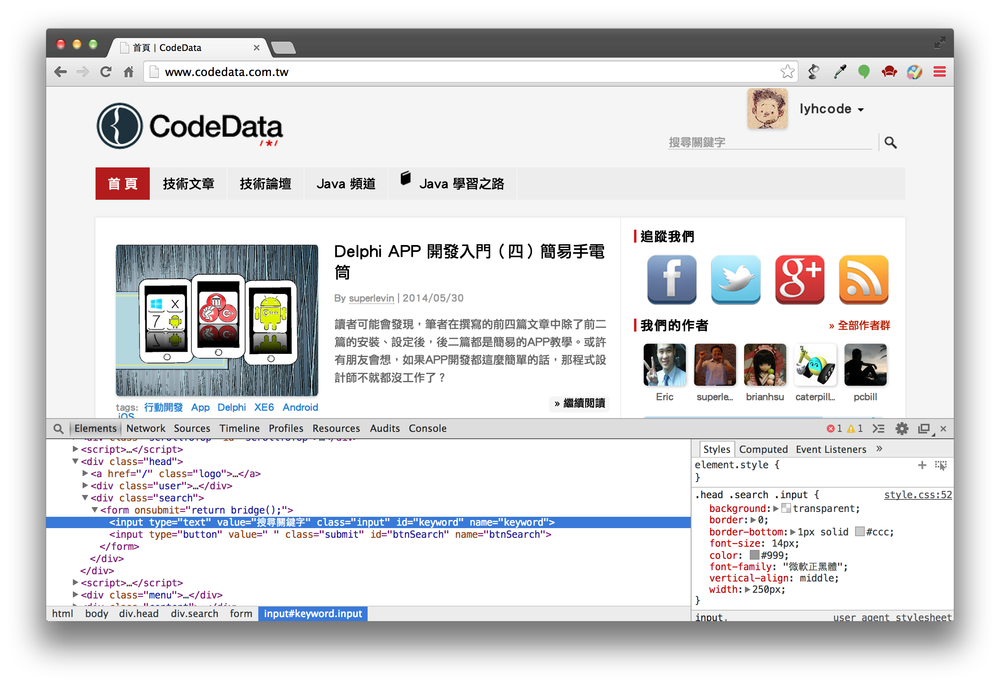

## Geb Navigator API ##

在撰寫瀏覽器自動化程式時，需要大量的 DOM 操作，正確找到一個 Element 才能對它做進一步的存取。在 Front-end 開發框架中，jQuery 已經提供一個多數 Web 開發者都已經熟悉的 Selector 機制，我們可以透過 Id 或 Class name 輕鬆找到一個目標的 Element。

以下是一些 jQuery 常見的 Selector 程式碼使用範例。

```
// jQuery Selector
$('div.errorMessage');
$('input#firstName');
$('button.confirm');
```

Geb 提供類似 jQuery Selector 的 Navigator API，讓開發者輕鬆找到一個 DOM 的 Element 物件。

尋找一個 `<div>` 及 `<div class="main">` 的語法，`$` 函數將會傳回一個 `Navigator` 物件。

```
// Geb Navigator
$("div")
$("div.main")
```

也可以利用 ID 尋找 Element。

```
$("#iframe1")
```

如果找到條件相符的 Element 有多項，則可以在第二個參數指定 0 取出第一個 Element；使用 `.first()` 也同樣可以傳回第一個項目。

```
$("div", 0)
$("div.main", 0)
$("div").first()
```

如果要找到 `<div title="section">` 的 Element，也可以這樣做。

```
$("div", title: "section")
$("div", 0, title: "section")
```

Navigator 找到的 Element 也可以進一步找到其上層，或繼續往它包含的子 Element 做搜尋。

```
$("table.books", 0).parent()
$("div.contents").find("table", cellspacing: '0')
```

### 使用 Navigator API ##

使用 Geb 命令瀏覽器開啟一個網頁之後，就可以開始對網頁畫面元素（elements）進行存取或控制。例如取得文字內容或填寫、點選表單元件等，這些流程是瀏覽器自動化的常見操作。

我們需要透過瀏覽器選取一個網頁元素，Geb 透過 Navigator API 提供方便的篩選功能，能夠幫助開發者快速準確找到所需要的網頁元素。

以 CodeData 網站為例，以下範例是找出「搜尋關鍵字」這個文字方塊的表單欄位，並填入「groovy」關鍵字，然後點選旁邊的放大鏡按鈕開始搜尋。

要找到特定的網頁元素，我們需要先觀察網頁的 HTML 原始碼。但是只從 Web Server 回應的 HTML 原始資料，經常不足以取得所需的資訊；現代網站很多前端畫面是由 JavaScript 動態產生，DOM 的內容在網頁讀取後還會有所改變，我們可以搭配瀏覽器的除錯工具，例如在 Google Chrome 瀏覽器的網頁中，只要選取右鍵選單的「檢查元素」就能開啟除錯工具（如下圖）。



學會使用網頁除錯工具，是開始撰寫自動化測試程式的第一步。

利用 Navigator API 尋找網頁中特定的元素，通常我們可以利用 HTML 標籤的 id 或 class 屬性，表單欄位也可以用 name 屬性做篩選。

例如 CodeData 網站的搜尋區塊原始碼如下，包含兩個 `<input />` 標籤都是我們需要找到的目標網頁元素。

```
  <div class="search">
    <form onsubmit="return bridge();">
      <input type="text" value="搜尋關鍵字" class="input" id="keyword" name="keyword">

      <input type="button" value=" " class="submit" id="btnSearch" name="btnSearch">
    </form>
  </div>
```

以這段 HTML 代碼而言，使用 `id` 來尋找目標元素，是最簡單快速的做法。Navigator API 的基本用法與 jQuery Selector 相當類似，以下是填寫關鍵字並按下搜尋按鈕的範例。

```
$('#keyword').value('groovy')
$('#btnSearch').click()
```

目標元素沒有設定 `id` 屬性也是常遇到的情況，Geb Navigator API 也可以利用 `class` 屬性選取元素。相同功能的程式碼改寫如下：

```
$('div.search .input').value('groovy')
$('div.search .submit').click()
```

也可以使用目標元素的某個屬性（attribute）做選取，例如表單元件很適合以 `name` 屬性值篩選。

```
$('input', name: 'keyword').value('groovy')
$('input', name: 'btnSearch').click()
```

使用 `class` 屬性可以找到符合篩選條件的多筆目標元素，如果要知道共找到幾個元素，只要使用 `size()` 方法即可取得數量值。

```
println $('.list .block h3 a').size()
```

搭配 Groovy 的 `each` 方法，可以對找到的多筆網頁元素進行存取控制。以下程式碼示範將搜尋結果中每一篇文章的標題印出。

```
$('.list .block h3 a').each { elem ->
  println elem.text()
}
```

以下是 CodeData 網站搜尋功能自動化操作的完整範例程式碼。

```
@Grapes([
    @Grab('org.gebish:geb-core:0.12.2'),
    @Grab('org.seleniumhq.selenium:selenium-firefox-driver:2.46.0'),
    @Grab('org.seleniumhq.selenium:selenium-support:2.46.0')
])
import geb.Browser

Browser.drive {
    go 'http://www.codedata.com.tw/'

    $('input', name: 'keyword').value('groovy')
    $('input', name: 'btnSearch').click()

    $('.list .block h3 a').each { elem ->
        println elem.text()
    }
}
```

### 學習資源

由於 Selector 機制與 jQuery 非常相似，便可以利用 jQuery 廣大的資源快速學習。
* [w3schools jQuery](http://www.w3schools.com/jquery/jquery_selectors.asp)：有許多範例，並提供線上改線上測的界面，可方便快速的學習語法。
* [jQuery Selector Tester](http://www.w3schools.com/jquery/trysel.asp)
