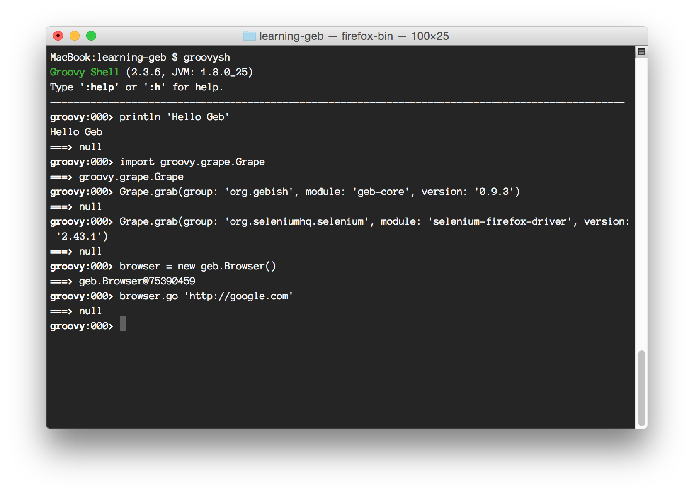

# 使用 Groovy Shell 執行 Geb

使用 Groovy Shell 開始學習 Geb

Groovy Shell 是 REPL（Read–eval–print loop）的 command-line 工具，可以方便測試 Groovy 程式碼，每次輸入一行指令，按下 Enter 就能立即執行並看到結果。

在 Groovy Shell 輸入指令時，可以按下 Tab 列出某個 Package 下有哪些可用類別或是某個物件有哪些方法可以存取。

需要的軟體

* JDK
* Groovy
* Firefox 瀏覽器

打開終端機（Terminal）程式，輸入「groovysh」開始執行 Groovy Shell 程式。

```bash
$ groovysh
```

看到「`groovy:000>`」提示，就可以開始執行接下來提供的範例指令。以下是執行 Groovy Shell 的終端機畫面，從畫面中可以看到，每次執行一行指令，指令回傳結果會立即顯示在「`===>`」後面。



先執行一段程式，測試 Groovy Shell 的操作。這是一段很簡易的 Groovy Hello World 程式，將一段訊息顯示在終端機，只要使用 `println` 指令。

```groovy
println 'Hello Geb'
```

執行結果。

```groovy
groovy:000> println "Hello Geb"
Hello Geb
===> null
```

Geb 並不是 Groovy 內建的套件，它需要從網路上的 Maven 套件庫（repositories）下載。Groovy 的 Grapes 功能可以自動完成套件的下載工作，包含套件所依賴的其他相關套件，也會自動解析並取得。

在 Groovy Shell 底下使用 Grapes，需要先做 `import` 引用 `Grape` 類別。

```groovy
import groovy.grape.Grape
```

使用 `Grape` 提供的 `grab()` 方法，取得所需的 Geb 套件。

```groovy
Grape.grab(group: 'org.gebish', module: 'geb-core', version: '0.10.0')
```

以 [geb-core](http://mvnrepository.com/artifact/org.gebish/geb-core/0.9.3) 套件為例，在 [MVNRepository](http://mvnrepository.com/) 網站可以利用搜尋功能，找到開放源碼專案的 Maven Repository，藉此得到套件所需的參數，例如：

* group = org.gebish
* module = geb-core
* version = 0.10.0

引用 Selenium WebDriver 套件，這裏我們使用 Selenium 的 Firefox WebDriver，它不需要額外的設定，只要在電腦上已經安裝最新版的 Firefox 瀏覽器軟體。

```groovy
Grape.grab(group: 'org.seleniumhq.selenium', module: 'selenium-firefox-driver', version: '2.44.0')
```

建立一個 `Browser` 的物件。

```groovy
browser = new geb.Browser()
```

這裡所建立的 `browser` 讓我們可以開始和瀏覽器進行互動，接下來，我們以 Google 搜尋為例，讓瀏覽器幫我們自動完成關鍵字搜尋、並解析搜尋結果的內容。

使用 `go` 指令，開啟 Google 搜尋首頁的 URL 位址。

```groovy
browser.go 'http://google.com'
```

執行後，Geb 會開啟一個 Firefox 瀏覽器視窗，然後打開 Google 搜尋首頁。

利用瀏覽器的除錯工具，找到表單的 `<form />` 標籤，觀察什麼可以用來當「唯一的選擇器」。

```html
<form class="tsf" action="/search" id="tsf" method="GET"
      name="f" onsubmit="return q.value!=''" role="search">
```

以這段表單 HTML 代碼的 `<form />` 元素，可用的選擇器（selector）。

* form.tsf
* form#tsf
* form[name=f]

使用 `id` 比較能確保找到正確的 DOM 節點（node）。

```groovy
form = browser.$('form#tsf')
```

使用 `size()` 方法，可以得知 `find()` 是否找到目標節點。以此例而言，執行 `form.size()` 會得到回傳值「`1`」。

```groovy
form.size()
```

Google 首頁輸入搜尋關鍵字的文字方塊，其 `<input />`標籤的原始碼如下。

```html
<input class="lst lst-tbb sbibps" id="lst-ib" maxlength="2048"
       name="q" autocomplete="off" title="搜尋" type="text" value="">
```

由於這個 `<input />`是 `<form />` 的表單欄位，Geb 提供很簡單的方式可以存取欄位內容。

```groovy
form.q = 'jcconf 2014'
```

這段程式碼執行後，可以看到瀏覽器在關鍵字的欄位貼入「jcconf 2014」文字內容。

接下來觀察「Google 搜尋」按鈕的原始碼。

```html
<input value="Google 搜尋" name="btnK" jsaction="sf.chk" type="submit">
```
得知利用「btnK」可以找到此按鈕的 DOM 節點，使用選擇器「`input[name=btnK]`」找到搜尋按鈕。

```groovy
btnK = form.find('input[name=btnK]')
```

接著觸發點擊（click）事件，送出表單資料。

```groovy
btnK.click()
```

Geb 與表單的按鈕進行互動，還可以用更簡單的方式：

```groovy
form.btnK().click()
```

可以看到瀏覽器顯示搜尋結果。

觀察搜尋結果的 HTML 原始碼，可以得知搜尋結果的網頁連結，被放在 `<h3>` 的節點下。

```html
<h3 class="r">
    <a ... href="http://twjug.kktix.cc/events/jcconf2014-cfp">
        JCConf Taiwan 2014 Call for Papers
    </a>
```

利用 Groovy 的 each 方法，把搜尋結果的每個標題文字取出，並依序顯示。

```groovy
browser.$('h3').each { println it.text() }
```

使用 Groovy 的 collect 方法，可以將標題全部放到一個 ArrayList 裡面。

```groovy
browser.$('h3').collect { it.text() }
```

這段程式碼，示範如何將 Google 搜尋結果，轉換成 Markdown 格式的內容輸出。

```groovy
browser.$('h3 a').each { println "* [${it.text()}](${it.attr('href')})" }
```

獲取 HTML 原始碼。

```groovy
browser.driver.pageSource
```

使用 Groovy Shell 很適合 Geb 入門學習。

未來在撰寫測試程式時，Groovy Shell 也可以用來執行一些實驗，不必重新跑完整個測試程式，就能即時調整一些參數，立即看到執行的結果並加以修正。
