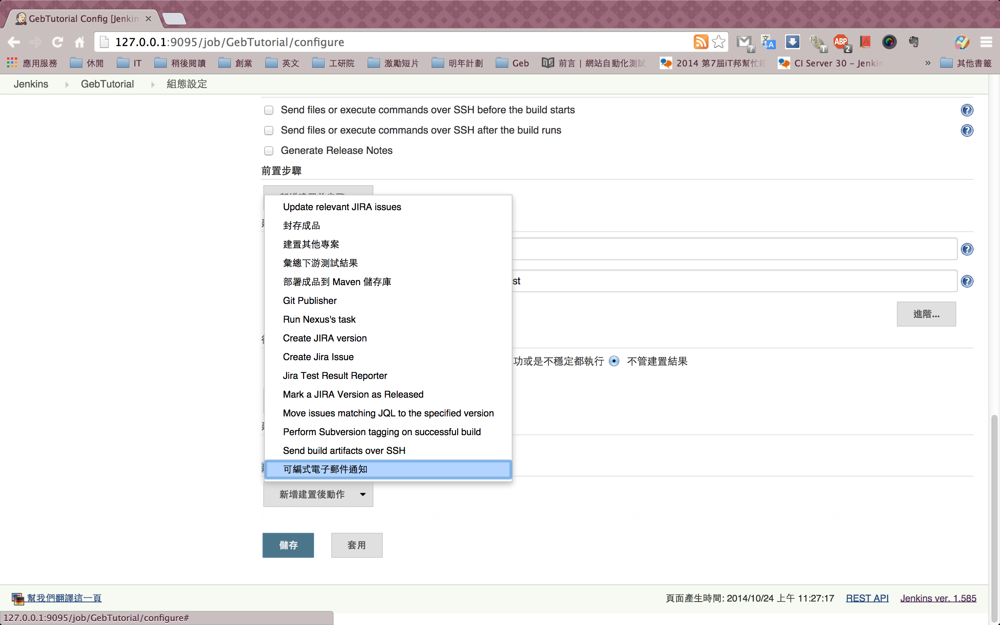
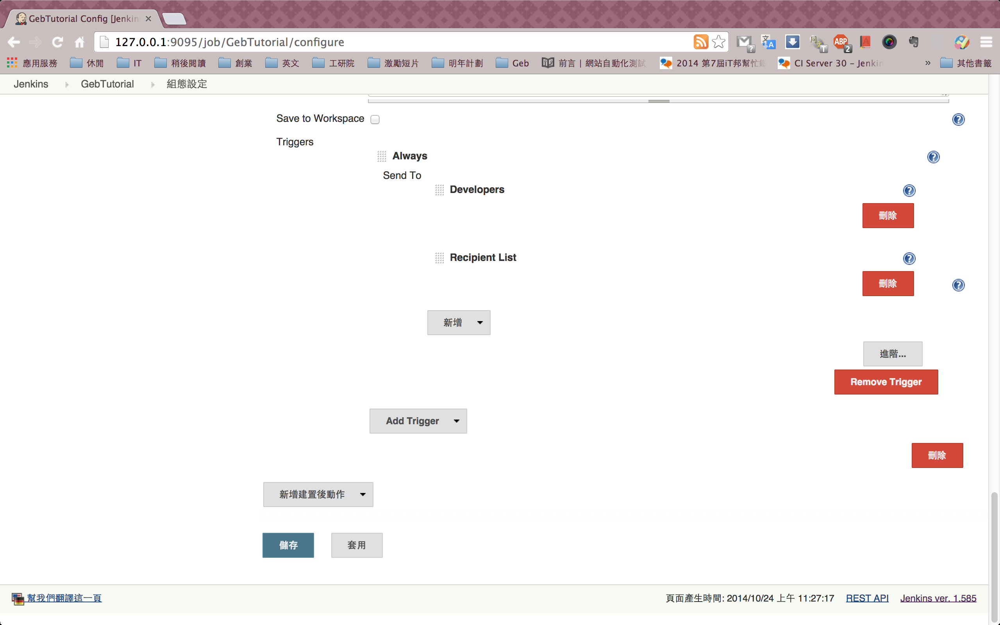
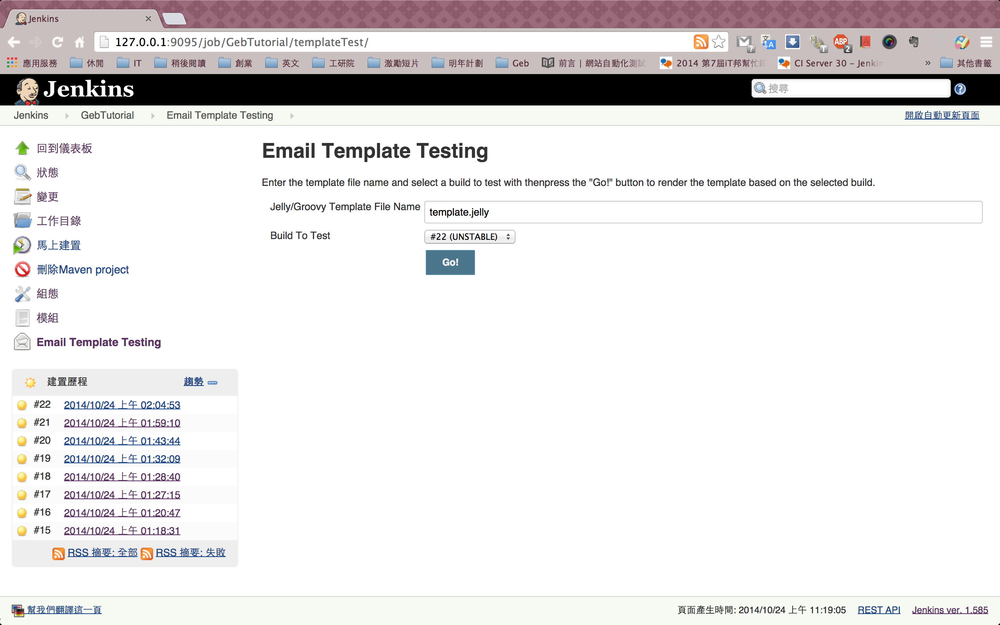
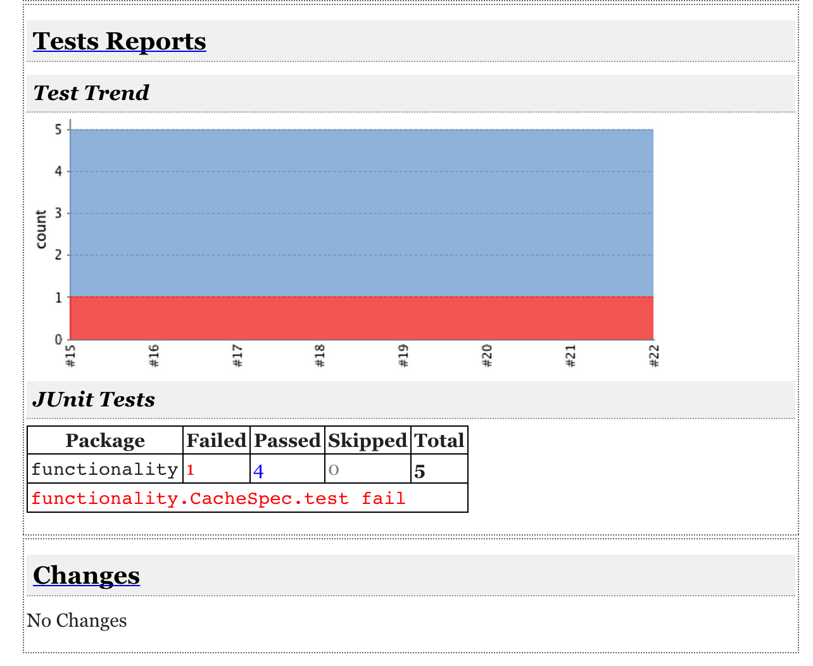

## 通知信
Jenkins會透過發信通知專案建構的狀態，預設是一個非常簡略的信件內容，可額外安裝 [Email-ext plugin](https://wiki.jenkins-ci.org/display/JENKINS/Email-ext+plugin) ，來寄送自定的信件內容。

### 自定Email Templates

#### 建立預設資料夾
先自行建立Templates需要的預設資料夾，資料夾名稱要一樣，不能修改。

```
mkdir $JENKINS_HOME/email-templates
```

#### 建立Email範本
將網路上抓的範本，或自行編寫的格式，放入這個預設資料夾中。
```
git clone https://gist.github.com/10349704.git
cp 10349704/jenkins-email-ext-clangScanReport-template.jelly $JENKINS_HOME/email-templates/template.jelly
```

#### 設定專案組態
在專案組態設定中，新增建置動作，選擇「可編式電子郵件通知信」



修改「專案收件人清單」、「內容類型」、「預設內容」
* 專案收件人清單：你要接收通知信的信箱
* 內容類型：HTML
* 預設內容：${JELLY_SCRIPT,template="template.jelly"}


點擊Advanced Settings，刪除預設的Trigger，然後新增Always Trigger，不管測試結果如何都要寄送。



#### 預覽通知信
在左側有一個Email Template Testing的功能，點進去之後設定你的template檔案名稱，就可以預覽通知信了。



預覽結果



