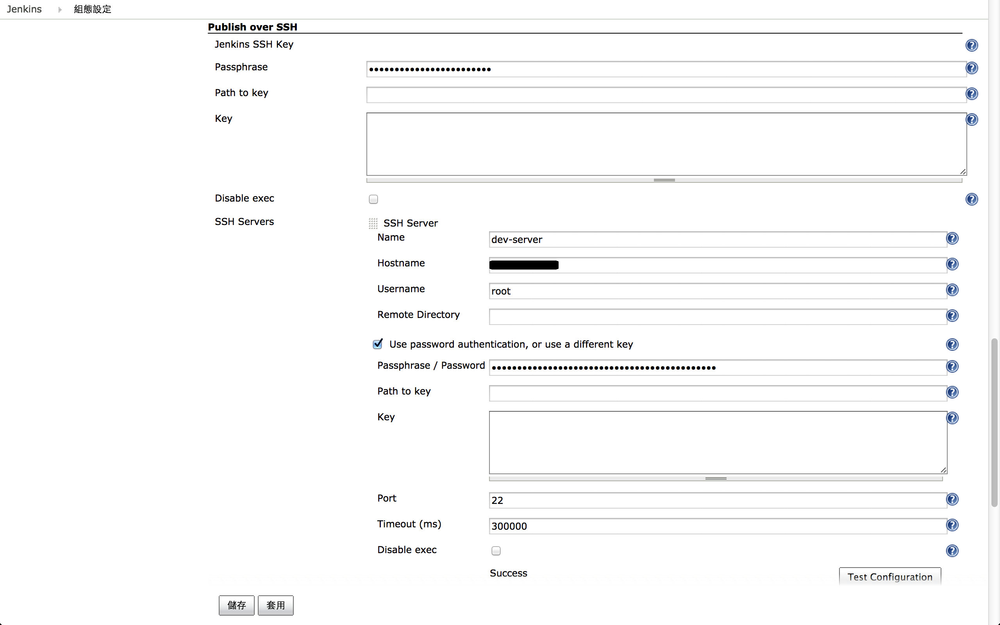
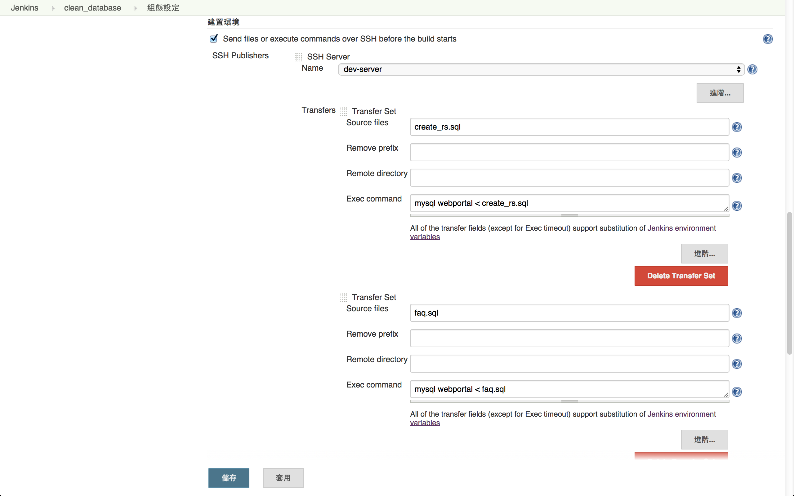

## 初始化資料庫

常常有時候測試失敗，未必是測試邏輯有關，而是跟資料庫存在髒資料有關，所以在做一個完整測試之前，我們會需要清空資料庫的值，在匯入系統預設。通常我們會維護一份初始化用的SQL檔，我們可以把這個一系列的動作，也建立一個Job執行，並將這個專案設為自動化測試專案的上層專案，確保測試時，資料庫都是乾淨單純的。

## 設定Shell下Mysql免密碼

編輯 mysql 設定檔

```bash
vi /etc/my.cnf
```

新增這兩行

```
[client]
    password=YOUR_MYSQL_PASSWORD
```

設定檔案權限

```bash
chmod 600 /etc/my.cnf
```

## 設定 SSH server

* 管理 Jenkins -> 設定系統 -> Publish over SSH



## 建立清除資料庫的 Jobs

* 新增作業 -> 設定作業名稱 -> 建立 FreeStyle 軟體專案


## 設定清除資料庫的 Jobs

* 設定初始化資料庫 sql 檔，放置的 SVN 或 Git 路徑
* 選取資料庫所在的 SSH server
* 設定要傳送的 sql 檔檔名
* 設定 sql 匯入指令


