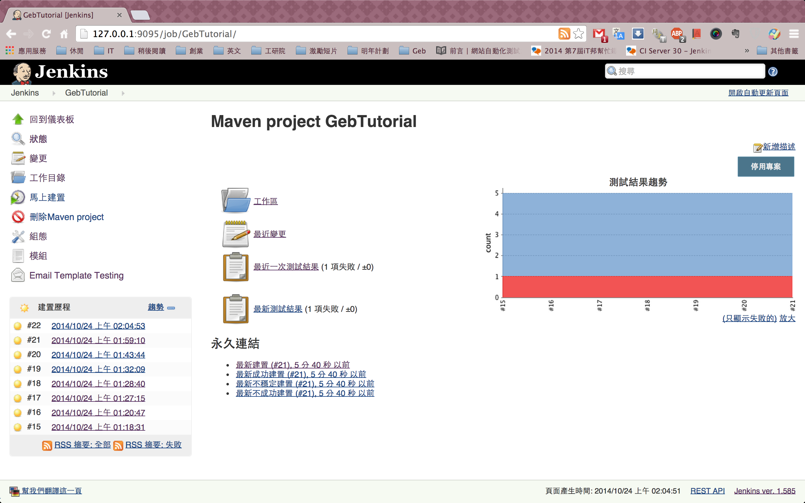
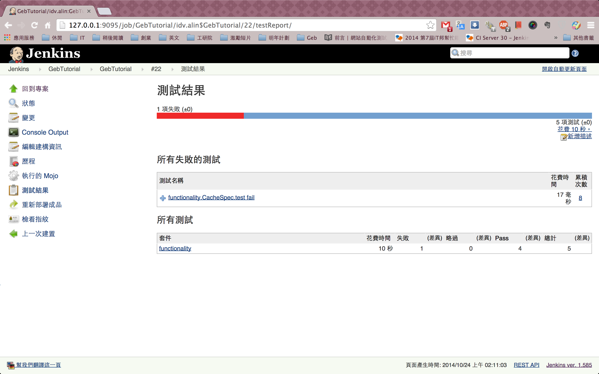
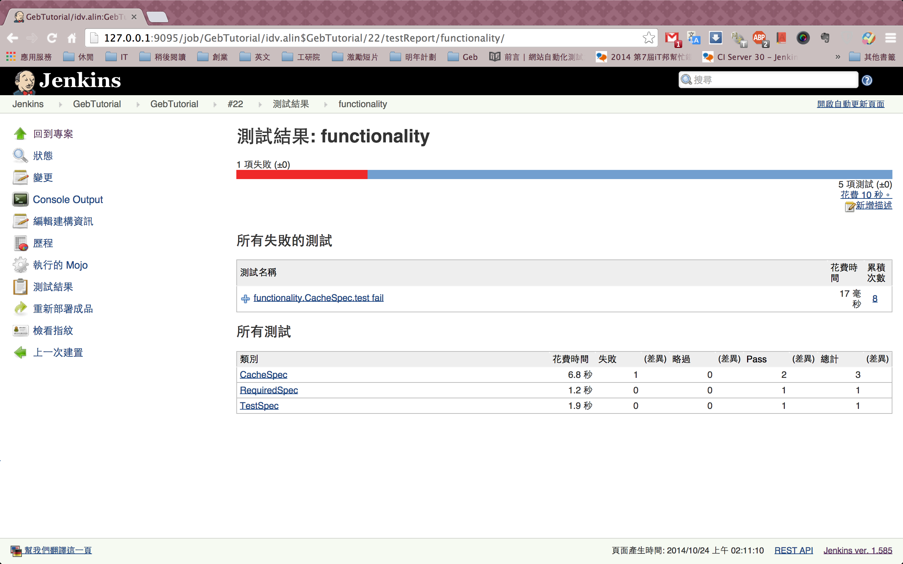
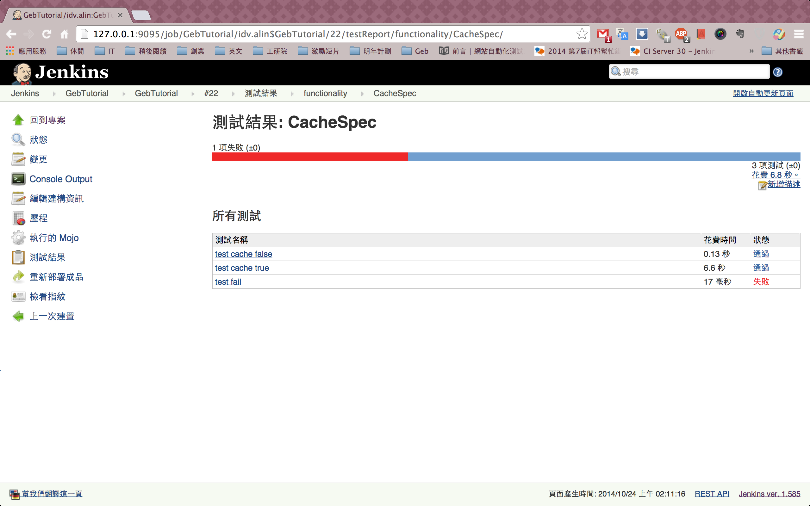
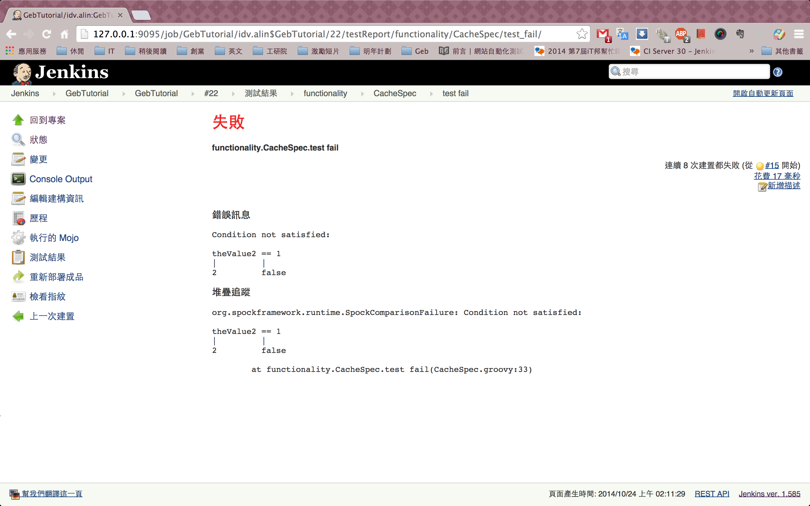

# 測試結果

在範例中，我們使用了 maven surefire 產出 Junit 格式的報表，Jenkins 預設會自動截取 Junit 格式報表的資料，轉用更親和力的圖形化報表來呈現。

**pom.xml**

```xml
<plugin>
    <groupId>org.apache.maven.plugins</groupId>
    <artifactId>maven-surefire-plugin</artifactId>
    <version>${maven.surefire.version}</version>
    <configuration>
        <!-- 略 -->
    </configuration>
</plugin>
```

**趨勢圖**

需在建構歷程有兩次以上的記錄時，才會出現。



**彙整測試結果**


**測試結果之套件**



**測試結果之類別**



**測試結果之類別步驟**



**錯誤訊息**


