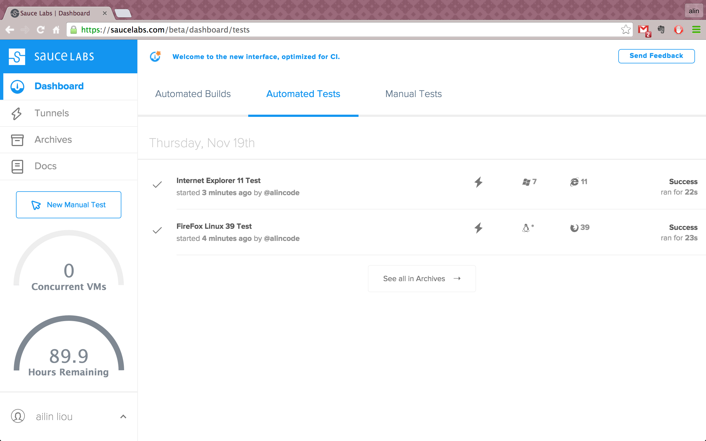
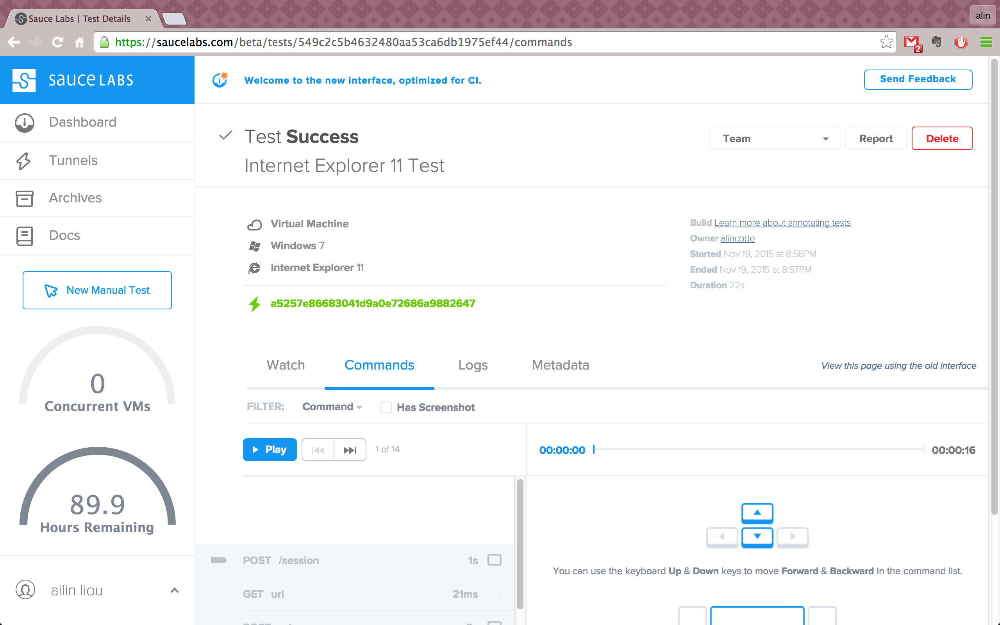
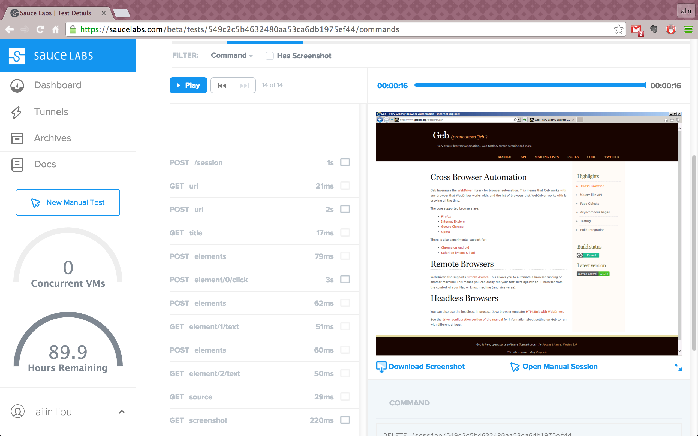

# 實戰 Sauce Labs

## 範例

*** GebConfig.groovy ***
```
import geb.driver.SauceLabsDriverFactory

def sauceLabsBrowser = System.getProperty("geb.saucelabs.browser")
if (sauceLabsBrowser) {
    driver = {
       def username = System.getenv("GEB_SAUCE_LABS_USER")
       assert username
       def accessKey = System.getenv("GEB_SAUCE_LABS_ACCESS_PASSWORD")
       assert accessKey
       new SauceLabsDriverFactory().create(sauceLabsBrowser, username, accessKey)
    }
}

baseUrl = 'http://gebish.org'
```

*** build.gradle ***
```
import geb.gradle.saucelabs.SauceAccount

apply plugin: "geb-saucelabs"

buildscript {
    repositories {
        mavenCentral()
    }
    dependencies {
        classpath 'org.gebish:geb-gradle:0.12.2'
    }
}

repositories {
    mavenCentral()
    maven { url "http://repository-saucelabs.forge.cloudbees.com/release" }
}

dependencies {
    // 這裡是列出新增的，以簡化範例。
    sauceConnect "com.saucelabs:ci-sauce:1.81"
}

sauceLabs {
    browsers {
        firefox_linux_39 {
            capabilities(
                    name: "FireFox Linux 39 Test",
                    browserName: "FireFox",
                    passed: "true"
            )
        }
        internet_explorer_11{
            capabilities(
                    name: "Internet Explorer 11 Test",
                    browserName: "iexplore",
                    passed: "true",
                    screenResolution: "1280x1024",
                    version: "11",
                    platform: "Windows 7"
            )
        }
    }
    task {
        testClassesDir = test.testClassesDir
        testSrcDirs = test.testSrcDirs
        classpath = test.classpath
    }
    account {
        username = System.getenv(SauceAccount.USER_ENV_VAR)
        accessKey = System.getenv(SauceAccount.ACCESS_KEY_ENV_VAR)
    }
```
完整範例下載：[geb-with-sauce-labs](https://github.com/readbook/learngeb/tree/master/example2/13/geb-with-sauce-labs)

## 測試結果

*** 自動化測試歷史記錄 ***

清楚的列出瀏覽器及作業系統的版本和測試花費的時間



*** 測試詳細資訊 ***



*** 測試過程錄影 ***

每個測試結果都有獨立的錄影檔，可直接播放來追蹤當時的情況。


