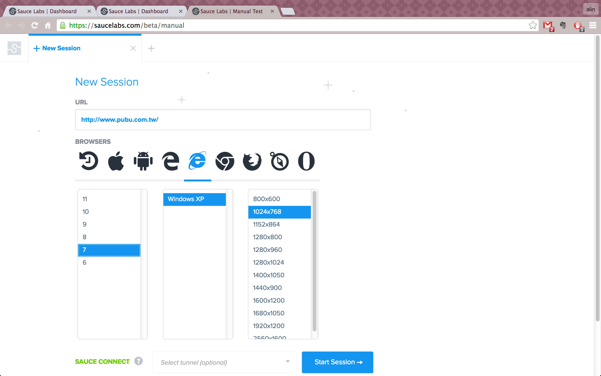
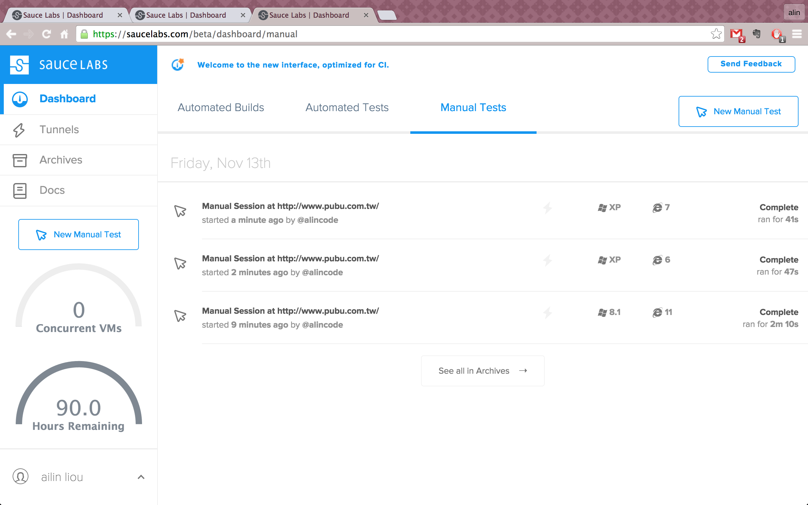

# 介紹 Sauce Labs

它是一個線上測試服務平臺，有提供手動測試及自動測試兩種測試服務，對於 IOS、Android、Windowns 和 Linux 都有支援。

最低方案是一個月16塊美金，綁定一個帳號，可同時開兩台VM，及兩小時的自動化測試方案，及無限制的手動測試方案。

*** 建立一個手動測試瀏覽器 ***

第一步選擇作業系統，然後再選擇瀏覽器版本跟螢幕的解析度大小，按下 `Start Session` 按鈕，

網站自動轉導到一個頁面嵌入遠端桌面功能的小視窗，結束之後退出小視窗，

你就可以看到手動測試的歷史記錄。

