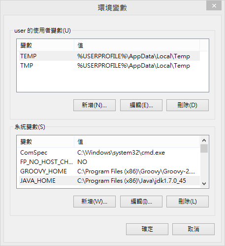
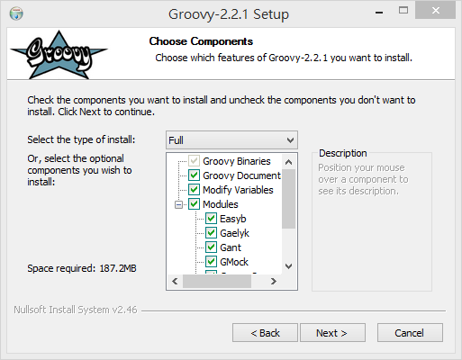

# 安裝 Groovy

Geb 需要 Java 與 Groovy。

## 安裝 Java

下載並安裝 JDK（Java SE Development Kit）軟體。

[Download Java SE Development Kit](http://www.oracle.com/technetwork/java/javase/downloads/jdk7-downloads-1880260.html)

正確設定 JAVA_HOME 環境變數。

安裝 JDK 之後必須設定 JAVA_HOME 環境變數，其設定值為 JDK 軟體安裝的路徑。

例如 Windows 系統的 JDK 安裝路徑是：

* `C:\Program Files\Java\jdk1.7.0_45`

可以在環境變數中，加上 JAVA_HOME 的**系統變數**設定。

Linux 或 Mac OS X 系統的使用者，可以利用 Shell 指令找到 JDK 安裝位置。

    ls -l `which java`

Mac OS X 常見的安裝路徑有：

* /System/Library/Frameworks/JavaVM.framework/Versions/CurrentJDK/Home
* /Library/Java/JavaVirtualMachines/jdk1.7.0_45.jdk/Contents/Home

Ubuntu Linux 常見的安裝路徑是：

* /usr/lib/jvm/default-java
* /usr/lib/jvm/java-7-oracle

若要在 Linux 或 Mac OS X 系統設定 JAVA_HOME 環境變數，常見的做法是在家目錄（$HOME）的 `.profile` 或 `.bashrc` 設定檔加上：

    export JAVA_HOME=...

確認 JDK 是否正確安裝，在終端機執行以下指令檢查版本資訊。

    java -version
    javac -version

看到正確的版本代號，就表示 Java 安裝與設定步驟已完成。

## 在 Windows 安裝 Groovy

Groovy 提供 Windows 系統的自動安裝程式，可以輕鬆完成安裝。

* 下載安裝程式：[Groovy 2.2.1 Windows Installer](http://dist.codehaus.org/groovy/distributions/installers/windows/nsis/groovy-2.2.1-installer.exe)

在安裝過程中可以選擇需要的模組，如果磁碟容量充足，建議使用完整安裝以取得全部功能。

安裝步驟完成後，就可以在 Windows 應用程式集找到「Start GroovyConsole」的啟動捷徑。

** Windows x64 系統安裝注意事項 **

如果使用 64 位元的 Windows 系統，請特別留意目前的 Groovy for Windows 安裝程式僅支援 32 位元，因此需要同時安裝一份 32 位元的 JDK 版本，並且將 JAVA_HOME 設定為 JDK x86 版本的安裝路徑。

* `C:\Program Files (x86)\Java\jdk1.7.0_45`

# 在 Mac OS X 安裝 Groovy

Mac OS X 系統專用的安裝方式有兩種。

使用 [HomeBrew](http://brew.sh/) 安裝工具：

    brew install groovy

使用 [MacPorts](http://www.macports.org/) 安裝工具：

    sudo port install groovy

利用 HomeBrew 或 MacPorts 工具安裝 Groovy，可以方便日後升級版本或移除。

## 在 Linux 安裝 Groovy

Ubuntu Linux 與 Debian 可以使用 `apt-get` 指令安裝：

    sudo apt-get install groovy

RedHat 或 CentOS 等 RPM-based Linux 系統，可以使用 `yum` 指令安裝：

    sudo yum install groovy

如果喜歡手動裝方式，也可以直接下載安裝最新版本，解壓縮到指定的路徑：

    curl -O http://dist.groovy.codehaus.org/distributions/groovy-binary-2.2.1.zip
    unzip groovy-binary-2.2.1.zip /usr/local

選擇自行手動安裝 Groovy，請確認 JAVA_HOME 與 GROOVY_HOME 環境變數皆有正確的設定，並建議加到 $HOME 資料夾下的 `.bashrc` 或 `.profile` 設定檔。

    export JAVA_HOME=/usr/local/jdk-1.7.0
    export GROOVY_HOME=/usr/local/groovy-2.2.1

## 使用 GVM 安裝 Groovy（推薦）

GVM 是安裝 Groovy 的專用工具，它支援 Mac OS X 及 Linux 系統。

受到 RVM（Ruby Version Manager）的啟發，Groovy 的開發社群也發展出類似的安裝管理工具， GVM（Groovy enVironment Manager）可以自動下載安裝最新的 Groovy 版本，也可以方便在不同 Groovy 版本之間輕鬆切換。

安裝 GVM（不需要 root 權限）。

    curl -s get.gvmtool.net | bash

重新打開終端機，讓 GVM 的環境變數設定生效。

使用 GVM 安裝 Groovy 的最新版本。

    gvm install groovy

使用 GVM 還可以查詢、指定安裝的版本號碼，切換至某個版本或者設定為預設版本。以下是一些指令使用範例：

    # 查詢可供安裝的版本
    gvm ls groovy

    # 安裝指定版本
    gvm install groovy 2.1.9

    # 在當前的 Shell 中使用指定的版本
    gvm use groovy 2.1.9

    # 設定預設使用的版本
    gvm default groovy 2.1.9

    # 顯示目前正在使用的版本
    gvm current groovy

## 檢查 Groovy 版本

安裝完成後，先檢視 Groovy 的版本，確定 Groovy 程式可以被執行。

在終端機執行「`groovy -version`」指令，可以檢查目前正在使用中的 Groovy 與 JVM 版本。

    groovy -version

如果 Groovy 已正確安裝，直行後會顯示版本資訊。

    Groovy Version: 2.2.1 JVM: 1.7.0_45 Vendor: Oracle Corporation OS: Mac OS X -->
