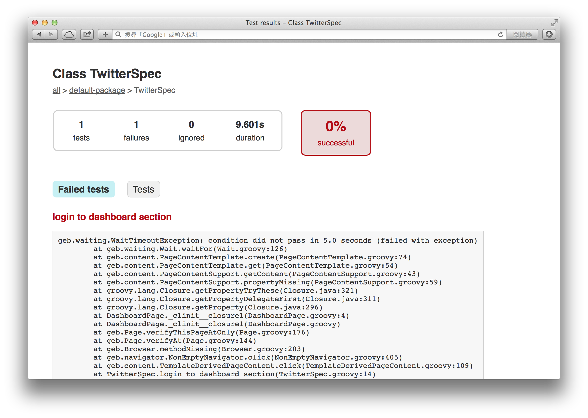

# Geb + Spock + Gradle

以 Gradle 建置工具示範 Geb + Spock 的測試流程整合，以下是所需要的 `build.gradle` 設定範例。

```groovy
apply plugin: 'groovy'

repositories {
    mavenCentral()
}

dependencies {
    groovy "org.codehaus.groovy:groovy-all:2.3.6"


    // spock-core
    testCompile "org.spockframework:spock-core:0.7-groovy-2.0"

    // geb, geb-spock
    testCompile "org.gebish:geb-core:0.10.0"
    testCompile "org.gebish:geb-spock:0.10.0"
    testCompile "org.seleniumhq.selenium:selenium-firefox-driver:2.42.0"
    testCompile "org.seleniumhq.selenium:selenium-support:2.44.0"
}
```

分別定義兩個 Page 物件，分別對應 Twitter 登入表單與主畫面。

範例：`src/test/groovy/LoginPage.groovy`（登入表單）

```groovy
import geb.Page

class LoginPage extends Page {
    static url = "https://twitter.com/login"
    static at = { heading.text() == "登入 Twitter" }
    static content = {
        heading { $("h1") }
        loginForm { $("form.signin") }
        loginButton(to: DashboardPage) { $("button.submit") }
    }
}
```

範例：`src/test/groovy/DashboardPage.groovy`（主畫面）

```groovy
import geb.Page

class DashboardPage extends Page {
    static at = { heading.text() == "推文" }
    static content = {
        heading(wait: true) { $("h2#content-main-heading") }
    }
}
```

使用 Spock 定義一個測試案例，驗證輸入正確的帳號密碼後顯示主畫面。

範例：`src/test/groovy/TwitterSpec.groovy`

```groovy
import geb.Page
import geb.spock.GebSpec

class TwitterSpec extends GebSpec {
    def "login to dashboard section"() {
        given:
        to LoginPage

        when:
        $('input.js-username-field').value("username")
        $('input.js-password-field').value("password")

        and:
        loginButton.click()

        then:
        at DashboardPage
    }
}
```

執行 Gradle 的 test 任務時，就會執行 Geb 測試程式。

```bash
gradle test
```

測試結果也會整合在輸出報表。



整合到專案自動化建置的 Geb 測試程式，會成為專案自動化測試流程的一部份，在使用 Jenkins CI 持續整合時，也順帶完成瀏覽器自動化測試，[完整程式碼](https://github.com/lyhcode/GroovyTutorial/tree/master/src/09_GebWebTest/gradle-spock-geb) 下載。

## 參考資源

* [The Book of Geb](http://www.gebish.org/manual/current/)
* [Taming Functional Web Testing with Spock and Geb](http://www.infoq.com/presentations/testing-spock-geb) ([slides](http://qconlondon.com/dl/qcon-london-2013/slides/PeterNiederwieser_TamingFunctionalWebTestingWithSpockAndGeb.pdf))
