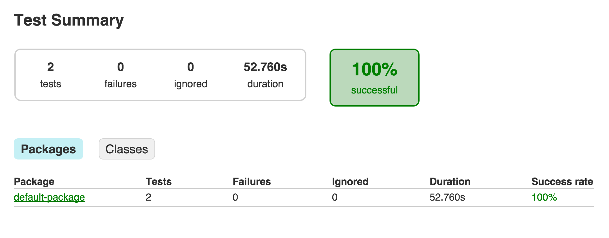
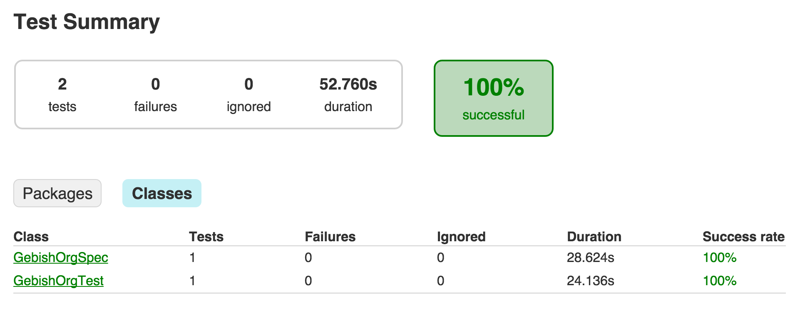

# Geb + Spock + Gradle

以 Gradle 建置工具示範 Geb + Spock 的測試流程整合，此範例是來官方範例簡化，以便於理解。

範例：`build.gradle`

```groovy
ext {
    drivers = ["firefox"]

    ext {
        groovyVersion = '2.4.1'
        gebVersion = '0.12.2'
        seleniumVersion = '2.46.0'
    }
}

apply plugin: "groovy"

repositories {
    mavenCentral()
}

dependencies {
    // 設定與 Spock相關的lib
    testCompile "org.gebish:geb-spock:$gebVersion"
    testCompile("org.spockframework:spock-core:1.0-groovy-2.4") {
        exclude group: "org.codehaus.groovy"
    }
    // 設定 Groovy lib
    testCompile "org.codehaus.groovy:groovy-all:$groovyVersion"

    // Drivers
    testCompile "org.seleniumhq.selenium:selenium-firefox-driver:$seleniumVersion"
}

// 一次宣告多個 Task
drivers.each { driver ->
    task "${driver}Test"(type: Test) {
        // e.g. firefoxTest
        reports {
            html.destination = reporting.file("$name/tests")
            junitXml.destination = file("$buildDir/test-results/$name")
        }
        // 每次都要執行
        outputs.upToDateWhen { false }
        systemProperty "geb.build.reportsDir", reporting.file("$name/geb")
        systemProperty "geb.env", driver
    }
}

test {
    dependsOn drivers.collect { tasks["${it}Test"] }
    enabled = false
}
```

範例：`src/test/resources/GebConfig.groovy`

```groovy
import org.openqa.selenium.firefox.FirefoxDriver

waiting {
	timeout = 2
}

environments {
	firefox {
		driver = { new FirefoxDriver() }
	}
}

baseUrl = "http://gebish.org"

```

分別定義兩個 Page 物件，分別對應 Geb 首頁與操作手冊頁。

範例：`src/test/groovy/GebishOrgHomePage.groovy`（首頁）

```groovy
import geb.Page

// Geb 首頁
class GebishOrgHomePage extends Page {

    static at = { title == "Geb - Very Groovy Browser Automation" }

    static content = {
        manualsMenu { module MenuModule, $("#header-content ul li", 0) }
    }
}
```

範例：`src/test/groovy/TheBookOfGebPage.groovy`（使用手冊）

```groovy
import geb.Page

// Geb 使用手冊頁面
class TheBookOfGebPage extends Page {
    static at = { title.startsWith("The Book Of Geb") }
}

```

使用 Spock 定義一個測試案例，驗證位於首頁的使用手冊 Menu 連結可以用正常使用。

範例：`src/test/groovy/GebishOrgSpec.groovy`

```groovy
import geb.spock.GebReportingSpec

class GebishOrgSpec extends GebReportingSpec {

    def "can get to the current Book of Geb"() {
        when:
        to GebishOrgHomePage

        and: // 點擊 Manuals 的 Menu 的連結
        interact {
            moveToElement(manualsMenu.toggle)
        }

        then: // 點擊最新版本的 Manuals 的連結
        manualsMenu.links[0].text().endsWith("- CURRENT")

        when:
        manualsMenu.links[0].click()

        then:
        at TheBookOfGebPage
    }
}
```

範例：`src/test/groovy/MenuModule.groovy`

```groovy
import geb.Module

class MenuModule extends Module {
    static content = {
        toggle { children("span") }
        links { $('.link-list li a') }
    }
}

```


執行 Gradle 的 test 任務時，就會執行 Geb 測試程式。

```bash
gradle test
```

## 報表
測試結果也會整合在輸出報表。

### Package


### Classes


整合到專案自動化建置的 Geb 測試程式，會成為專案自動化測試流程的一部份，在使用 Jenkins CI 持續整合時，也順帶完成瀏覽器自動化測試。

## 官方的 Github 範例
[範例下載](https://github.com/geb/geb-example-gradle)

## 參考資源

* [The Book of Geb](http://www.gebish.org/manual/current/)
* [Taming Functional Web Testing with Spock and Geb](http://www.infoq.com/presentations/testing-spock-geb) ([slides](http://qconlondon.com/dl/qcon-london-2013/slides/PeterNiederwieser_TamingFunctionalWebTestingWithSpockAndGeb.pdf))
