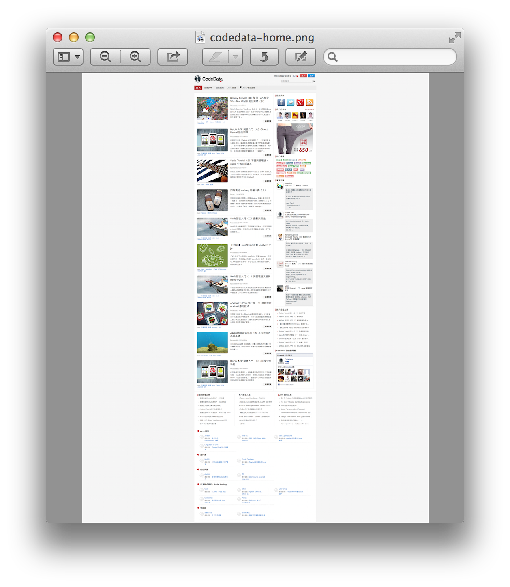

# API 和 範例
這些是[ Browser ](http://www.gebish.org/manual/snapshot/api/geb/Browser.html)類別內的method
* void report(String label)
* void reportGroup(String path)
* cleanReportGroupDir()

以下是將 CodeData 首頁截圖的範例

```groovy
Browser.drive {
    config.reportsDir = new File('/tmp')
    go 'http://www.codedata.com.tw/'
    report 'codedata-home'
}
```

`report` 指令的參數是測試報告的名稱，圖片及原始碼檔案會依此命名，在指定的存放路徑下產生 .png 及 .html 檔案。

* /tmp/codedata-home.html
* /tmp/codedata-home.png

對自動化測試的任務，保留各階段測試的畫面，可以彙整成一份更詳盡的測試報告。如果要撰寫一個 Web Screen Capture 的程式，使用 Geb 也可以輕鬆完成。



