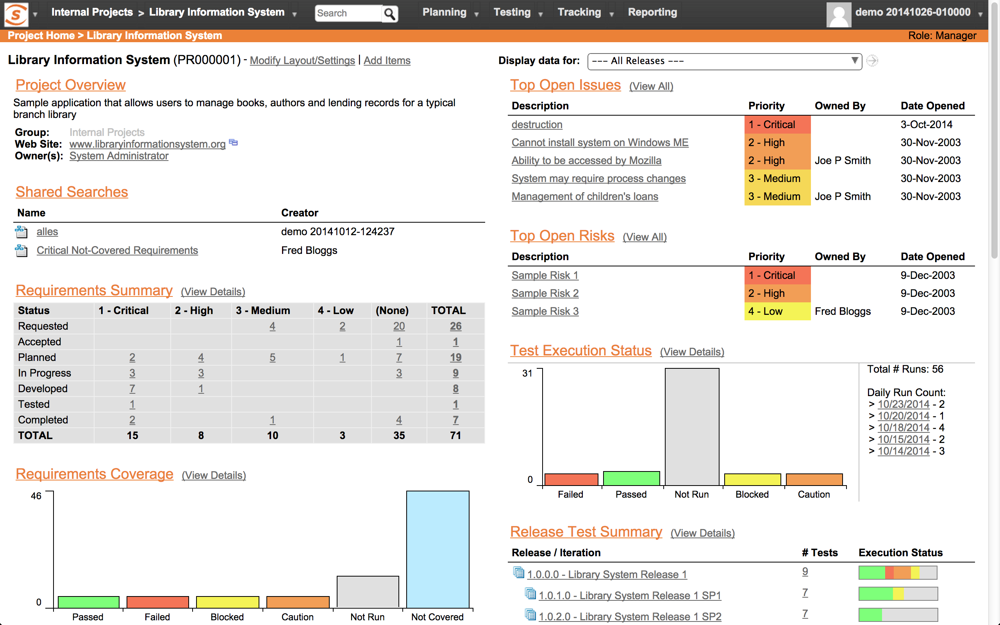

# 整合 Spira Test

[Spria Test](http://www.inflectra.com/SpiraTest/)  提供一個友善的儀表板式界面，呈現測試結果。一開始會先提出 Requirement，然後再針對需求建立所需的數個 Test Case，測試執行後，每次都會產出一個對應 Test Case 的 Test Run，來呈現測試的結果。

** Spira Test 網站地圖**

* Planning
	* Requirements 需求書
	* Releases 版號
	* Documents 文件
* Testing
	* Test Cases 測試案例
	* Test Sets  測試集合
	* Test Runs  測試結果
	* Automation Hosts	測試主機
